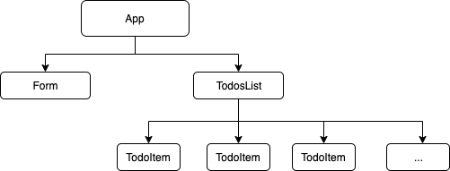

# Pursuit-Core-Web-React-Lifecycle-Methods-Lab

## Demo

## Component Tree
Your App should have a component tree somewhat like the following

## Tasks
Build an app that has the following functionality:

- Users can create a new Todo
- Users can delete an existing Todo
- Creating or deleting a Todo should show a toast notification

For the toasts notifications, use the [react-toastify](https://github.com/fkhadra/react-toastify) library.

### Details
* Submitting a new todos should not require a submit button. 
* You will only have one state and that state will live in App.
* Implement lifecycle methods to fire the created/deleted notification.

